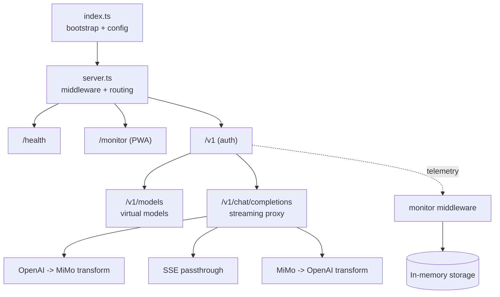

# Mimo Proxy 架构

OpenAI-compatible facade for Xiaomi MiMo：协议转换、SSE 透传、虚拟模型预设、内置监控（内存态，重启清空）。

## 架构图



## 模块

```text
src/
├── index.ts
├── server.ts
├── config.ts
├── routes/        # /v1
├── proxy/         # transform + streaming
├── monitor/       # middleware + routes + in-memory storage
├── models/        # presets
└── utils/logger.ts
```

## 设计约束

- **Streaming-first**: no full-buffer in chat path.
- **Model preset**: `mimo-{preset}-{modelId}` -> `upstreamModel + features`.
- **Non-intrusive telemetry**: read-only middleware + async/non-blocking write to memory.
- **Ephemeral state**: monitoring data kept in process memory only; restart clears all.
- **Path safety**: frontend/redirect all relative paths (`./...`).
- 