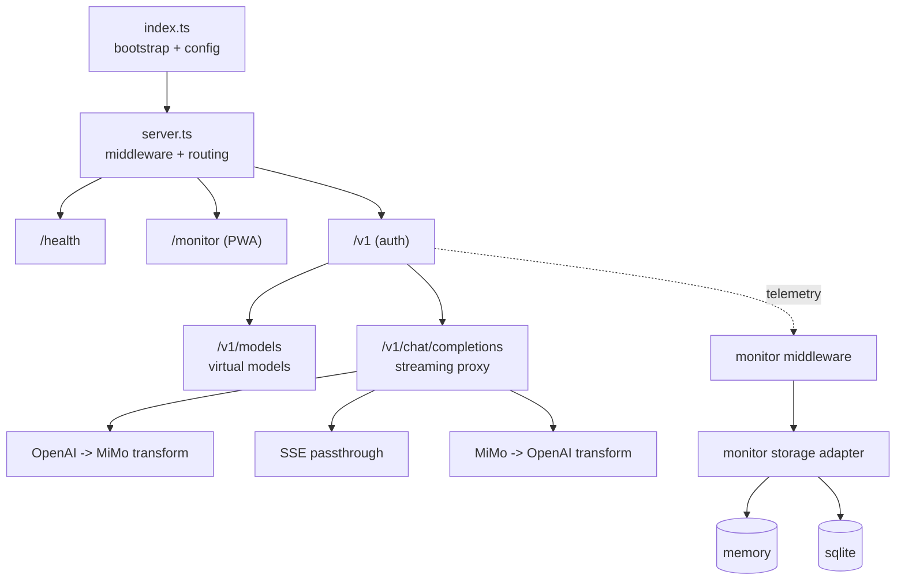

# Mimo Proxy 架构

OpenAI-compatible facade for Xiaomi MiMo：协议转换、SSE 透传、虚拟模型预设、内置监控（支持内存态/SQLite 持久化）。

## 技术栈

- **Runtime**: Node.js 24 LTS
- **Language**: TypeScript 5
- **HTTP**: Express 5 + CORS
- **Config**: dotenv
- **Storage**: memory / SQLite（`sqlite3 + sqlite`）
- **Dev/Build**: ts-node、nodemon、tsc、pnpm 10

## 架构图



## 模块

```text
src/
├── index.ts
├── server.ts
├── config.ts
├── routes/                # /v1
├── proxy/                 # transform + streaming
├── monitor/
│   ├── middleware.ts
│   ├── routes.ts
│   └── storage/           # interface + memory + sqlite + async writer
├── models/                # presets
└── utils/logger.ts
```

## 存储抽象与字段模型

`MonitorStorage` 统一接口：

- `append(event)`
- `query(params)`
- `stats(params)`
- `prune(retentionDays)`
- `close()`

### Request-level 事件模型（默认不持久化 payload）

- `request_id`
- `ts_start` / `ts_end` / `latency_ms`
- `path` / `method` / `status_code`
- `model_requested` / `model_upstream`
- `stream` / `chunks` / `bytes_out` / `first_token_ms`
- `input_tokens` / `output_tokens` / `cached_prompt_tokens` / `cost`
- `error_type`

## Monitor 数据流

1. `monitorMiddleware` 仅采集元信息并调用 `storageWorker.append(event)`。
2. `storageWorker` 维护异步队列：
   - 达到 `MONITOR_FLUSH_BATCH_SIZE` 立即 flush
   - 每 `MONITOR_FLUSH_INTERVAL_MS` 定时 flush
   - 写入失败最多重试 3 次，失败项按 FIFO 语义回到队尾（避免顺序反转）
3. `MonitorStorage` 实现：
   - `memory`：进程内存（重启丢失）
   - `sqlite`：`sqlite3 + sqlite` 异步持久化（WAL / NORMAL / busy_timeout=5000）
4. `getStorage()` 启动阶段优先初始化 sqlite，失败时自动降级 `memory` 并记录错误日志。
5. `/monitor/stats`、`/monitor/calls` 统一走 `storage.stats/query`。
6. 退出时由主进程调用 `stopCleanupTask()` 与 `await storageWorker.shutdown()`，完成队列 flush 后 `close()`。

## SQLite 设计要点

- 自动创建数据库目录（默认 `./data/monitor.db`）
- `requests` 表存 request-level 核心字段
- 插入策略：`ON CONFLICT(request_id) DO NOTHING`（重复请求幂等）
- 索引：
  - `requests(ts_start)`
  - `requests(status_code, ts_start)`
  - `requests(model_requested, ts_start)`

## 实现与早期设计差异说明

- 目前将流式统计字段（`chunks/bytes_out/first_token_ms`）先并入 `requests`，未拆分 `stream_stats` 子表。
- `/monitor/calls` 为前端兼容保留旧字段映射（如 `timestamp/model/inputTokens`），同时附带新字段。

## 设计约束

- **Streaming-first**: no full-buffer in chat path.
- **Model preset**: `mimo-{preset}-{modelId}` -> `upstreamModel + features`.
- **Non-intrusive telemetry**: read-only middleware + async/non-blocking write.
- **Configurable state backend**: `memory` (ephemeral) / `sqlite` (persistent).
- **Privacy-by-default**: no prompt/response raw payload persistence.
- **Path safety**: frontend/redirect all relative paths (`./...`).
