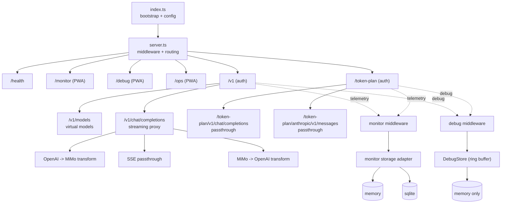

# Mimo Proxy 架构

OpenAI-compatible facade for Xiaomi MiMo：协议转换、SSE 透传、虚拟模型预设、内置监控（支持内存态/SQLite 持久化）、可选调试模式（完整 payload 内存记录）、token-plan 透传代理（挂载于主应用 `/token-plan` 路径下）。

## 技术栈

- **Runtime**: Node.js 24 LTS / Bun 1.x
- **Language**: TypeScript 5
- **HTTP**: Express 5 + CORS
- **Config**: dotenv
- **Storage**: memory / SQLite（`sql.js`）
- **Dev/Build**: ts-node、nodemon、tsc、pnpm 10、Bun

## 架构图



## 模块

```text
src/
├── index.ts
├── server.ts
├── config.ts
├── shutdownManager.ts
├── routes/                # /v1
├── proxy/                 # transform + streaming
├── token-plan/
│   └── server.ts          # createTokenPlanRouter() — 透传路由器
├── monitor/
│   ├── middleware.ts
│   ├── routes.ts
│   └── storage/           # interface + memory + sqlite + async writer
├── debug/
│   ├── index.ts
│   ├── types.ts
│   ├── store.ts           # DebugStore (ring buffer)
│   ├── middleware.ts
│   ├── routes.ts
│   └── frontend/index.html
├── models/                # presets
├── ops/                   # 运维界面
└── utils/logger.ts
```

## Token-Plan 透传代理

Token-plan 是小米的计费方案，使用不同的上游地址。通过 `createTokenPlanRouter()` 返回 `express.Router`，在主应用中以 `/token-plan` 前缀挂载，复用主应用的 CORS、JSON 解析、请求日志等基础中间件。

### 路由

| 路径 | 方法 | 说明 |
|------|------|------|
| `/token-plan/v1/chat/completions` | POST | OpenAI 格式透传 |
| `/token-plan/anthropic/v1/messages` | POST | Anthropic 格式透传 |

### 中间件链

1. 主应用 CORS（含 `anthropic-version`、`anthropic-beta` 头）
2. 主应用 `express.json()`
3. 主应用请求日志
4. Token-plan 鉴权中间件（`TOKEN_PLAN_PROXY_API_KEY`）
5. Debug 中间件（`DEBUG_ENABLED=true` 时）
6. 路由处理 -> 上游透传

### 设计优势

- 单端口、单进程，无需管理独立 HTTP server
- Debug 中间件自动覆盖 token-plan 请求，无需重复配置
- 优雅关闭只需关闭主 HTTP server

## 存储抽象与字段模型

`MonitorStorage` 统一接口：

- `append(event)`
- `query(params)`
- `stats(params)`
- `prune(retentionDays)`
- `close()`

### Request-level 事件模型（默认不持久化 payload）

- `request_id`
- `ts_start` / `ts_end` / `latency_ms`
- `path` / `method` / `status_code`
- `model_requested` / `model_upstream`
- `stream` / `chunks` / `bytes_out` / `first_token_ms`
- `input_tokens` / `output_tokens` / `cached_prompt_tokens` / `cost`
- `error_type`

## Monitor 数据流

1. `monitorMiddleware` 仅采集元信息并调用 `storageWorker.append(event)`。
2. `storageWorker` 维护异步队列：
   - 达到 `MONITOR_FLUSH_BATCH_SIZE` 立即 flush
   - 每 `MONITOR_FLUSH_INTERVAL_MS` 定时 flush
   - 写入失败最多重试 3 次，失败项按 FIFO 语义回到队尾（避免顺序反转）
3. `MonitorStorage` 实现：
   - `memory`：进程内存（重启丢失）
   - `sqlite`：`sql.js` 纯 JavaScript 实现（WAL / NORMAL / busy_timeout=5000）
4. `getStorage()` 启动阶段优先初始化 sqlite，失败时自动降级 `memory` 并记录错误日志。
5. `/monitor/stats`、`/monitor/calls` 统一走 `storage.stats/query`。
6. 退出时由主进程调用 `stopCleanupTask()` 与 `await storageWorker.shutdown()`，完成队列 flush 后 `close()`。

## SQLite 设计要点

- 自动创建数据库目录（默认 `./data/monitor.db`）
- `requests` 表存 request-level 核心字段
- 插入策略：`ON CONFLICT(request_id) DO NOTHING`（重复请求幂等）
- 索引：
  - `requests(ts_start)`
  - `requests(status_code, ts_start)`
  - `requests(model_requested, ts_start)`

## Debug 模块

可选的调试模块（`DEBUG_ENABLED=true`），记录完整的请求/响应体到内存环形缓冲区。同时覆盖主应用 API 路由和 token-plan 透传路由。

### DebugStore

- 纯内存环形缓冲区，同步读写，无持久化，进程重启即清空
- `append(event)` -- 写入，超限时淘汰最旧记录
- `query(params)` -- 内存中过滤和搜索
- `getById(id)` -- 按 request_id 查找
- `prune()` -- 清空缓冲区

### debugMiddleware

- monkey-patch `res.json` 捕获非流式响应体
- monkey-patch `res.write` 收集流式 SSE chunks
- monkey-patch `res.end` 组装并存储调试事件
- 在 monitor middleware 之前挂载，确保捕获原始响应
- 在主应用 `/v1`、`/anthropic/v1` 和 token-plan `/v1`、`/anthropic/v1` 上均挂载

### 数据流

1. `debugMiddleware` 拦截 `/chat/completions` 和 `/messages` 请求
2. 序列化 `req.body` 为请求体快照
3. 通过 monkey-patch 收集完整响应体（非流式 via `res.json`，流式 via `res.write`）
4. `res.end` 时组装 `DebugEvent` 并写入 `DebugStore`
5. `/debug/calls` API 返回列表（含 preview），`/debug/calls/:id` 返回完整 body

## 多模态数据流

MiMo Proxy 支持透传多模态数据（图片、音频等），采用 **passthrough-first** 策略：不解析或修改 `messages` 中的多模态 content parts，原样转发给上游 API。

### 请求侧（客户端 → 上游）

| 环节 | 处理方式 | 多模态影响 |
|:-----|:---------|:----------|
| `express.json()` | 解析 JSON body，limit 10MB | base64 图片受 10MB 限制（约可承载 5-6MB 原图） |
| `transformRequest()` | 展开 `...clientBody`，只覆盖 model/thinking/tools 等字段 | `messages` 中的 `image_url`、`input_audio` 等 content parts 完整保留 |
| Anthropic 透传 | `{ ...clientBody, model: upstreamModel }` | `image` 类型 content block 完整保留 |
| Token-Plan 透传 | `JSON.stringify(req.body)` 原样序列化 | 所有多模态数据完整保留 |

### 响应侧（上游 → 客户端）

| 环节 | 处理方式 | 多模态影响 |
|:-----|:---------|:----------|
| SSE 流式传输 | 逐 chunk 转发，只替换 `model` 字段 | 流式响应中的多模态输出安全透传 |
| 非流式响应 | `res.json(responseBody)` 直接返回 | 多模态响应完整透传 |
| Monitor 中间件 | 只读取 `usage` 元数据 | 不影响多模态数据 |
| Debug 中间件 | 收集 SSE chunks 并组装 | Anthropic `image` 类型 content block 已支持组装 |

### 已知约束

1. **Body size 限制**：`express.json({ limit: "10mb" })` — 超大图片（base64 编码后 >10MB）会被拒绝
2. **仅支持 JSON body**：不支持 `multipart/form-data` 上传，图片必须以 base64 data URI 或 URL 形式嵌入 JSON
3. **无图片 URL 代理**：上游返回的图片 URL 不会被代理或重写，客户端需能直接访问该 URL
4. **无多模态内容校验**：代理层不校验图片格式、大小或 URL 合法性，完全依赖上游 API 报错

## 设计约束

- **Streaming-first**: no full-buffer in chat path.
- **Model preset**: `mimo-{preset}-{modelId}` -> `upstreamModel + features`.
- **Non-intrusive telemetry**: read-only middleware + async/non-blocking write.
- **Configurable state backend**: `memory` (ephemeral) / `sqlite` (persistent).
- **Privacy-by-default**: no prompt/response raw payload persistence (monitor).
- **Debug opt-in**: full payload recording only when `DEBUG_ENABLED=true`, memory-only.
- **Path safety**: frontend/redirect all relative paths (`./...`).
- **Single-port architecture**: token-plan 作为 router 挂载于主应用，消除独立端口。
- **Multimodal passthrough**: 多模态 content parts 原样透传，不做解析、校验或转换。