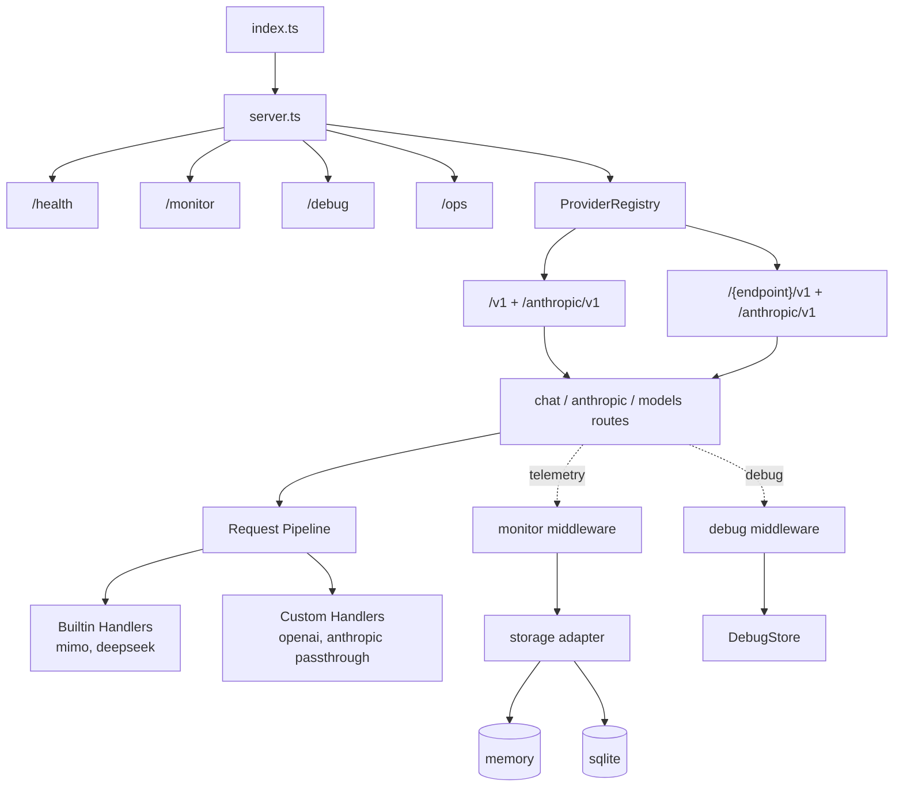

# Chimera 架构

## 系统职责

多提供商 LLM 代理。暴露 OpenAI 和 Anthropic 兼容的 API 端点，根据模型名称将请求路由到多个上游提供商（MiMo、DeepSeek 及用户自定义提供商）。核心能力：YAML 驱动的提供商配置、虚拟模型映射、SSE 流式透传、内置监控与调试。

## 设计原则

- **Streaming-first** — chat 路径无全量缓冲，逐 chunk 转发
- **YAML-driven config** — 提供商和模型配置完全由 YAML 驱动，无硬编码模型列表
- **Handler-based dispatch** — `type` 字段决定使用哪个 handler，内置 handler 做字段适配，自定义 handler 纯透传
- **Endpoint isolation** — 不同端点前缀的模型 ID 独立，同一 `endpoint` 内模型 ID 唯一
- **Single-port architecture** — 所有端点挂载于单个 Express 应用，无独立进程
- **Non-intrusive telemetry** — 只读中间件采集元信息，异步非阻塞写入
- **Privacy-by-default** — monitor 不持久化 prompt/response 原始内容
- **Multimodal passthrough** — 多模态 content parts 原样透传，不做解析或转换

## 技术栈

| 层 | 选型 |
|----|------|
| Runtime | Node.js 24 LTS / Bun 1.x |
| Language | TypeScript 5（strict mode, CommonJS output） |
| HTTP | Express 5 + CORS |
| Config | YAML（`yaml`）+ zod 验证 + dotenv |
| Storage | memory / SQLite（`sql.js`） |
| Dev/Build | ts-node、nodemon、tsc、pnpm 10、Bun |

## 系统结构



## 模块地图

```text
src/
├── index.ts                 # 启动入口
├── server.ts                # Express 应用 + 中间件 + 路由挂载
├── config.ts                # 环境变量统一消费
├── shutdownManager.ts       # 优雅关闭
├── providers/               # 提供商系统（详见 docs/architecture/provider-system.md）
│   ├── registry.ts          #   模型查找 + handler 分发
│   ├── loader.ts            #   YAML 加载 + 验证
│   ├── types.ts             #   接口定义
│   ├── builtin/             #   内置 handler（mimo, deepseek）
│   └── custom/              #   自定义 handler（openai, anthropic 透传）
├── routes/                  # API 路由（详见 docs/architecture/pipeline.md）
│   ├── chat.ts              #   /v1/chat/completions
│   ├── anthropic.ts         #   /anthropic/v1/messages
│   └── models.ts            #   /v1/models
├── proxy/                   # 代理核心
│   ├── streaming.ts         #   SSE 流式透传 + token 用量追踪
│   └── transformer.ts       #   结构适配（字段重命名）
├── monitor/                 # 监控（详见 docs/architecture/monitoring.md）
│   ├── middleware.ts
│   ├── routes.ts
│   ├── pricing.ts
│   └── storage/
├── debug/                   # 调试模块
├── ops/                     # 运维界面
└── utils/
    ├── logger.ts
    ├── auth.ts
    └── fetchWithTimeout.ts
```

## 部署视图

单进程、单端口。所有路由挂载于同一个 Express 应用：

```text
┌─────────────────────────────────────────────────┐
│                  Express App                     │
│                                                 │
│  /health                                        │
│  /monitor/*          ← 监控 API                 │
│  /debug/*            ← 调试 API + 前端          │
│  /ops/*              ← 运维界面                  │
│                                                 │
│  /v1/chat/completions                           │
│  /v1/models                                     │
│  /anthropic/v1/messages                         │
│                                                 │
│  /token-plan/v1/chat/completions                │
│  /token-plan/v1/models                          │
│  /token-plan/anthropic/v1/messages              │
│                                                 │
│  /{custom-endpoint}/v1/chat/completions         │
│  /{custom-endpoint}/v1/models                   │
│  /{custom-endpoint}/anthropic/v1/messages       │
└─────────────────────────────────────────────────┘
```

所有端点共享基础中间件（CORS、JSON 解析、请求日志、鉴权）。Provider 通过 `endpoint` 字段声明路由前缀，空字符串表示标准 `/v1` 和 `/anthropic/v1`。

## 关键场景

### OpenAI 兼容 Chat Completion

```text
Client → POST /v1/chat/completions
       → authMiddleware 验证 PROXY_API_KEY
       → modelRegistry.lookup(model, "/v1")
       → clone body → swap model → apply defaults → transformRequest
       → fetchWithTimeout → upstream
       → SSE stream passthrough → Client
       → monitor 记录元信息
```

### Anthropic 兼容 Messages

```text
Client → POST /anthropic/v1/messages
       → authMiddleware 验证 PROXY_API_KEY
       → modelRegistry.lookup(model, "")
       → clone body → swap model → apply defaults → transformRequest
       → fetchWithTimeout → upstream（anthropic_url ?? base_url）
       → SSE stream passthrough（含 message_start model 重写）
       → Client
       → monitor 记录元信息
```

### 模型列表

```text
Client → GET /v1/models
       → registry 返回该 endpoint 前缀下所有模型
       → owned_by = provider name
       → capabilities = provider-level ⊕ model-level
```

## 非目标

- 运行时动态添加/移除提供商
- 提供商间负载均衡
- 每提供商/模型限流
- 响应缓存
- 提供商健康检查 / 熔断
- 运行时配置热重载（当前版本，变更需重启）

## 文档导航

| 文档 | 内容 |
|------|------|
| [provider-system.md](docs/architecture/provider-system.md) | 提供商配置体系、handler 架构、接口定义 |
| [pipeline.md](docs/architecture/pipeline.md) | 请求处理流水线、路由过滤、鉴权、多模态透传 |
| [monitoring.md](docs/architecture/monitoring.md) | 监控存储、事件模型、调试模块 |
