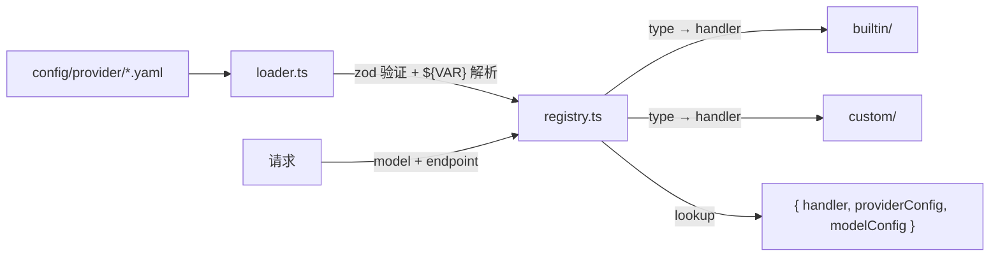

# 提供商系统

## 逻辑视图



### Registry

`ProviderRegistry` 按 endpoint 前缀作用域管理所有提供商和模型。

- **初始化**：loader 加载所有 YAML → 构建 registry
- **lookup(modelId, endpointPrefix)**：返回 `{ handler, providerConfig, modelConfig }`
  - 按 endpoint 前缀过滤候选提供商
  - 在候选中查找匹配的 model ID
  - 未找到 → 返回 null（路由层返回 HTTP 404）
- **getAllModels(endpointPrefix)**：返回该端点下所有模型（用于 `/v1/models`）

### Handler 分发

`type` 字段决定使用哪个 handler。内置 handler 做字段适配，自定义 handler 纯透传。

| type | handler | 协议支持 | 行为 |
|------|---------|----------|------|
| `mimo` | BuiltinMiMoHandler | OpenAI + Anthropic | 字段适配（`max_tokens` → `max_completion_tokens`） |
| `deepseek` | BuiltinDeepSeekHandler | OpenAI + Anthropic | 工具过滤（非 function tools 移除） |
| `openai` | CustomOpenAIHandler | OpenAI only | 纯透传 |
| `anthropic` | CustomAnthropicHandler | Anthropic only | 纯透传 |

内置 handler 可通过 `getDefaultBaseUrl()` / `getDefaultAnthropicUrl()` 提供默认 URL。自定义 handler 无默认 URL，必须在 YAML 中配置 `base_url`。

## 配置体系

### 配置文件布局

```text
config/
  builtin_provider/          # 版本控制，随发布分发（模板，运行时不加载）
    mimo.yaml
    mimo-token-plan-cn.yaml
    deepseek.yaml
  provider/                  # 活跃配置目录（CONFIG_DIR 环境变量，默认 ./config/provider/）。运行 init-config 后生成
    mimo.yaml                # init-config 从 builtin 复制（不存在时）
    mimo-token-plan-cn.yaml
    deepseek.yaml            # 永不覆盖已有文件
    my-custom.yaml           # 用户添加的自定义提供商
```

`pnpm run init-config` 将 builtin 模板复制到 `CONFIG_DIR`，仅在目标文件不存在时执行。

`CONFIG_DIR` 环境变量指定活跃配置目录，默认 `./config/provider/`。

### 设计规则

1. **`type` 决定协议和透传行为。** 自定义提供商仅服务原生协议，纯透传：`type: openai` → 仅 OpenAI 路由；`type: anthropic` → 仅 Anthropic 路由。除替换 `upstream` 和应用 `default` 外不做任何请求转换，不做跨协议格式转换。内置 handler（`deepseek`、`mimo`）服务两种端点并处理提供商特定字段适配（如 MiMo 的 `max_tokens` → `max_completion_tokens`），这不属于格式转换。

2. **优先级：客户端 > default。** `default` 值仅在客户端未发送该 key 时应用（基于原始客户端 body 判断，非转换后 body）。Handler 不注入任何字段值——所有提供商特定字段（`thinking`、`response_format`、`web_search` 等）通过 YAML `default` 配置。Handler 仅做结构适配（字段重命名、格式重组）。`transformRequest()` 同时接收最终 body（应用 default 后）和原始客户端 body，以区分客户端提供的值和 default 注入的值。

3. **`default` key 使用转换后名称**（`transformRequest` 之后），非原始客户端字段名。例如 MiMo 用 `default.max_completion_tokens` 而非 `default.max_tokens`，因为其 `transformRequest` 将 `max_tokens` 重命名为 `max_completion_tokens`。其他 handler（如 DeepSeek）直接透传 `max_tokens`。`default` 可包含提供商特定 key（`thinking`、`response_format`、`tools`、`web_search`）。Loader 验证拒绝与 `transformRequest` 无条件字段删除/重命名冲突的 `default` key（按 provider type 区分），但允许提供商特定 key。

4. **虚拟模型变体显式声明。** 所有变体在 YAML 中写出，无运行时自动生成。

5. **`${VAR}` 引用** 在加载时从 `process.env` 解析。缺失变量解析为空字符串，不阻塞启动。`api_key` 为空字符串表示无鉴权。

### 提供商级别字段

| 字段 | 必需 | 默认值 | 说明 |
|------|------|--------|------|
| `version` | 是 | — | Schema 版本（当前 `1`）。未知 → 致命错误 |
| `type` | 是 | — | Handler 类型：`mimo`、`deepseek`（内置）或 `openai`、`anthropic`（自定义） |
| `api_key` | 是 | — | API key，`${VAR}` 从 env 解析。空字符串 = 无鉴权 |
| `base_url` | 内置: 否。自定义: 是 | 内置: `handler.getDefaultBaseUrl()` | 上游 base URL。自动补全 `https://`（若未提供 scheme） |
| `anthropic_url` | 否 | 内置: `handler.getDefaultAnthropicUrl()`。自定义: 始终 `null` | Anthropic 端点独立 base URL。`null` = 不适用。自定义提供商始终为 `null`，`base_url` 用于原生协议。**注意：** 当 `base_url` 在 YAML 中被覆盖且 `anthropic_url` 未设置时，loader 从 handler 默认值派生，而非从覆盖后的 `base_url` 派生。如需不同的 Anthropic URL，须显式设置 `anthropic_url` |
| `auth_header` | 是 | — | 鉴权 HTTP header 名（如 `Authorization`、`api-key`）。单值 |
| `auth_prefix` | 否 | `""` | key 值前缀（如 `"Bearer "`） |
| `timeout` | 否 | `120000` | 上游请求超时（毫秒） |
| `endpoint` | 否 | `""` | 路由前缀。模型在 `{endpoint}/v1`（OpenAI）和/或 `{endpoint}/anthropic/v1`（Anthropic）提供服务，取决于 `type`。空字符串 = 标准 `/v1` 和 `/anthropic/v1`。规范化：`""` 保持 `""`；非空确保前导 `/`，去除尾部 `/` |
| `models` | 是 | — | 模型配置数组。空数组 → 记录警告，跳过提供商 |
| `capabilities` | 否 | `{}` | 提供商级别能力元数据，暴露在 `/v1/models` 的所有该提供商模型中。标准 key：`thinking`、`web_search`、`json_output`。描述提供商**支持**的能力（如 `thinking: true` 表示提供商可处理 thinking 请求），非当前激活状态。模型可通过模型级别 `capabilities` 覆盖 |
| `web_search` | 否 | `null` | web_search 工具参数的默认模板。作为提供商级别默认值——模型级别 `default.web_search` 覆盖这些值。Handler 在请求时组装工具对象。相同的 default 值模式适用于上游支持的所有工具。`web_search` 是主要示例，其已知参数如下 |

仅 `web_search` 有提供商级别字段，因为它是最高频配置的工具。其他工具通过模型级别 `default` 配置。

**`web_search` 已知参数**（均为可选 — 提供商级别默认值，模型级别 `default.web_search` 覆盖）：

| 参数 | 说明 |
|------|------|
| `max_keyword` | 最大搜索关键词数 |
| `force_search` | 强制搜索（即使不需要） |
| `limit` | 最大搜索结果数 |
| `user_location` | 搜索上下文的用户位置。对象，含 `country`、`region`、`city` |

### 模型级别字段

| 字段 | 必需 | 说明 |
|------|------|------|
| `id` | 是 | 客户端可见的虚拟模型 ID。同一 endpoint 内唯一。不同 endpoint 可使用相同 `id` |
| `upstream` | 是 | 发送给上游的真实模型 ID |
| `context_length` | 是 | 最大上下文 token 数。暴露在 `/v1/models` |
| `max_output_tokens` | 是 | 最大输出 token 数。暴露在 `/v1/models` |
| `description` | 否 | 人类可读描述。缺失时从 `id` 自动生成。暴露在 `/v1/models` |
| `created` | 否 | Unix 时间戳，用于 `/v1/models`。缺失时默认为配置加载时间 |
| `default` | 否 | 客户端未发送时应用的键值对（仅顶层，使用转换后 key）。可包含提供商特定 key（`thinking`、`response_format`、`tools`、`web_search`）定义变体行为。Handler 仅做结构适配——不注入、覆盖或删除提供商特定字段值 |
| `capabilities` | 否 | 对象（`{ thinking?: boolean, web_search?: boolean, json_output?: boolean, ... }`）。与提供商级别**浅合并**：模型级别 key 覆盖同名提供商级别 key；提供商级别中存在但模型级别未出现的 key 保留。暴露在 `/v1/models` |
| `pricing` | 否 | `{ input, cached_input?, output }` 每 1M token（平价）。存在 → 使用平价费率。缺失 → 使用 handler 的分层定价回退，按 `upstream` 查找（见 `src/monitor/pricing.ts`） |

### Loader 行为

启动时读取 `CONFIG_DIR` 下所有 `*.yaml`，使用 zod（strict mode，拒绝未知字段）验证，解析 `${VAR}`，应用上表默认值。对自定义提供商强制 `anthropic_url = null`（无论 YAML 如何设置）。工具参数（如 `web_search`）遵循与其他字段相同的 default 值模式——提供商级别值为默认值，模型级别 `default` 值覆盖。Loader 在加载时执行模型级别 `capabilities` 与提供商级别 `capabilities` 的浅合并。

提供商 `name` 始终从 YAML 文件名派生（去除扩展名），YAML 中不得包含 `name` 字段（strict mode 拒绝）。

**`ENABLED_PROVIDERS` 环境变量：** 逗号分隔的 provider 名称列表（匹配 YAML 文件名去扩展名）。仅加载列表中指定的 provider，其余静默跳过（debug 日志）。不设置或为空时加载全部。

**致命启动错误：**
- YAML 格式错误
- 未知 `type` 或 `version`
- `default` key 与 `transformRequest` 无条件字段删除/重命名冲突（当前仅 MiMo 的 `default.max_tokens` 被拒绝，因为其 `transformRequest` 将其重命名为 `max_completion_tokens`）。提供商特定 key（`thinking`、`response_format`、`tools`、`web_search`、`reasoning_effort`）允许出现在 `default` 中

**警告（非致命）：** 空 `models` 数组 → 跳过。

**模型 ID 冲突：** 同一 `endpoint` 内重复 `id` → 致命错误。不同端点的相同 `id` → 允许。

**`endpoint` 规范化伪代码：**
```
if (endpoint === "") return "";
const result = "/" + endpoint.replace(/^\/+/, "").replace(/\/+$/, "");
if (result === "/") return "";
return result;
```

加载后 `ProviderConfig` 所有字段完全填充，运行时无 `undefined`。

### 配置示例

```yaml
# config/builtin_provider/mimo.yaml（摘录）
version: 1
type: mimo
api_key: ${MIMO_API_KEY}
auth_header: api-key
auth_prefix: ""

capabilities:
  thinking: true
  web_search: true
  json_output: true

web_search:
  max_keyword: 3
  force_search: false
  limit: 5
  user_location:
    country: CN
    region: ""
    city: ""

models:
  - id: mimo-v2.5-pro
    upstream: mimo-v2.5-pro
    context_length: 1000000
    max_output_tokens: 128000

  - id: mimo-v2.5-pro-thinking
    upstream: mimo-v2.5-pro
    context_length: 1000000
    max_output_tokens: 128000
    default:
      thinking:
        type: enabled

  - id: mimo-v2.5-pro-thinking-search
    upstream: mimo-v2.5-pro
    context_length: 1000000
    max_output_tokens: 128000
    default:
      thinking:
        type: enabled
      web_search: true
    # Handler 从合并后的配置（提供商默认 + 模型覆盖）组装工具对象。
    # true → 最小工具对象；对象 → 使用提供的参数；缺失 → 无工具。
```

```yaml
# config/builtin_provider/mimo-token-plan-cn.yaml（摘录）
version: 1
type: mimo
api_key: ${TOKEN_PLAN_MIMO_API_KEY}
auth_header: api-key
auth_prefix: ""
base_url: https://token-plan-cn.xiaomimimo.com
anthropic_url: https://token-plan-cn.xiaomimimo.com/anthropic
endpoint: /token-plan

models:
  - id: mimo-v2.5-pro-tp
    upstream: mimo-v2.5-pro
    context_length: 1000000
    max_output_tokens: 128000
```

```yaml
# config/provider/my-openai.yaml
version: 1
type: openai
base_url: https://api.openai.com
api_key: ${OPENAI_API_KEY}
auth_header: Authorization
auth_prefix: "Bearer "

models:
  - id: gpt-4o
    upstream: gpt-4o
    context_length: 128000
    max_output_tokens: 16384
    pricing:
      input: 2.50
      cached_input: 1.25
      output: 10.00

  - id: gpt-4o-precise
    upstream: gpt-4o
    context_length: 128000
    max_output_tokens: 16384
    default:
      temperature: 0.2
```

## 代码架构

```text
src/providers/
  registry.ts          ← Type → handler 映射。Model lookup 按 endpoint 前缀作用域。
  loader.ts            ← YAML 加载、zod 验证、${VAR} 解析、default key 验证。
  types.ts             ← ProviderHandler、ProviderConfig、ModelConfig 接口。

  builtin/
    mimo.ts            ← MiMo handler：url 构造、transformRequest、已知模型。
    deepseek.ts        ← DeepSeek handler：url 构造、已知模型。
    index.ts           ← Map<string, BuiltinProvider>。

  custom/
    openai.ts          ← OpenAI 兼容透传。
    anthropic.ts       ← Anthropic 兼容透传。
```

## 接口契约

### ProviderHandler

```typescript
interface ProviderHandler {
  readonly type: string;
  // 返回完整上游 URL，null 表示不支持该协议。endpoint 前缀由 Express router 处理。
  getOpenAIUrl(baseUrl: string): string | null;
  getAnthropicUrl(baseUrl: string): string | null;
  getDefaultBaseUrl(): string | null;
  getDefaultAnthropicUrl(): string | null;
  // 仅结构适配（字段重命名、格式重组），不注入值。
  // originalClientBody：应用 default 前的原始客户端请求。
  // 用于区分客户端提供的值和 default 注入的值。
  // 自定义 handler 不修改 body。
  transformRequest(
    body: Record<string, unknown>,          // 应用 default 后的最终 body（原地修改）
    model: ModelConfig,
    originalClientBody: Record<string, unknown>,  // 原始客户端 body（应用 default 前）
    providerConfig: ProviderConfig,
  ): void;
}
```

- `getOpenAIUrl` / `getAnthropicUrl`：返回完整上游 URL，`null` 表示不支持该协议。endpoint 前缀由 Express router 处理，不由 handler 处理
- `transformRequest`：仅做结构适配（字段重命名），不注入值。自定义 handler 不修改 body。接收 `originalClientBody` 用于区分客户端提供的值和 default 注入的值——例如，只有客户端未提供 `max_tokens` 时才将其重命名为 `max_completion_tokens`，如果该值来自 default 则跳过（因为 default 已使用转换后的 key）

### ProviderConfig

```typescript
interface ProviderConfig {
  version: number;
  type: string;
  name: string;
  api_key: string;
  base_url: string;
  anthropic_url: string | null;
  auth_header: string;
  auth_prefix: string;
  timeout: number;
  endpoint: string;
  models: ModelConfig[];
  capabilities: Record<string, unknown>;
  web_search: Record<string, unknown> | null;
}
```

### ModelConfig

```typescript
interface ModelConfig {
  id: string;
  upstream: string;
  context_length: number;
  max_output_tokens: number;
  description?: string;             // 加载后始终有值（缺失时从 id 自动生成）
  created?: number;                 // 加载后始终有值（缺失时默认为配置加载时间）
  default?: Record<string, unknown>;
  capabilities?: Record<string, unknown>;  // 与提供商级别浅合并
  pricing?: {
    input: number;
    cached_input?: number;
    output: number;
  };
}
```
